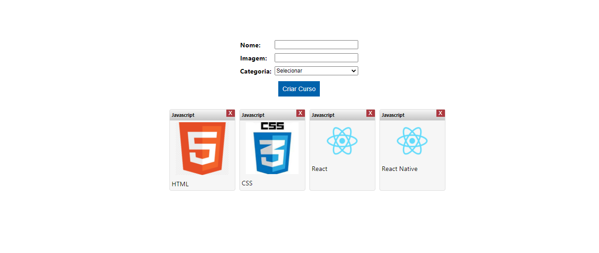

<h1 align="center">List Courses - React</h1> 

### :mag: Sobre o projeto 
O projeto consiste na criação de uma lista de cursos que ficam em cards. É possível adicionar e excluir. Criado utilizando os primeiros conceitos de ReactJS com classes durante curso de React - introdução da plataforma TreinaWeb.

### 🛠 Tecnologias

Utilizei conceitos de HTML, CSS, JSX, ReactJS.

### :key: Executar a aplicação

Clone este repositório
$ git clone https://github.com/raissaboeng/forms-to-add-courses-list-react.git

É necessário possuir node ou yarn instalados.

Abra a pasta do projeto pelo seu terminal.

Dentro da pasta do projeto pelo terminal executar o comando
$ npm start

Caso use Yarn
$ yarn start

Vai abrir em: http://localhost:3000/

Em outro terminal execute o comando para iniciar o simulador de bd da treinaweb
$ tw-dev-server

Vai estar executando em: http://localhost:3002/

Para acessar o simulador de banco de dados: https://treinaweb.github.io/tw-dev-server/
Nele terá o acesso aos métodos GET, POST, PUT, DELETE para testar o BD.